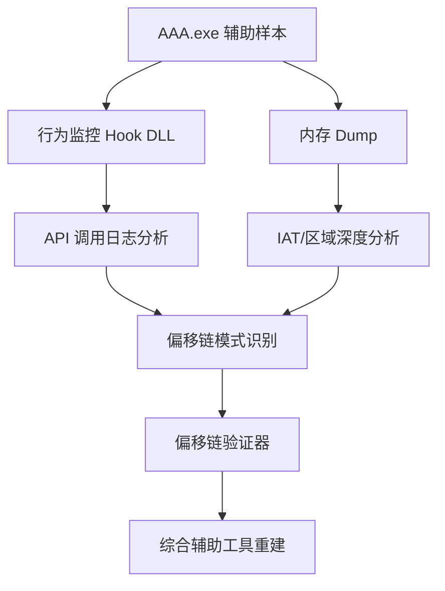

# AAA.exe 分析流水线

从辅助样本到偏移链提取的多阶段分析流程

## Sources

- 6/analysis/使用说明.md
- 6/analysis/ApiMonitor_AAA.md

```mermaid
graph TD
    A[AAA.exe 辅助样本] --> B[行为监控 Hook DLL]
    A --> C[内存 Dump]
    B --> D[API 调用日志分析]
    C --> E[IAT/区域深度分析]
    D --> F[偏移链模式识别]
    E --> F
    F --> G[偏移链验证器]
    G --> H[综合辅助工具重建]
```
