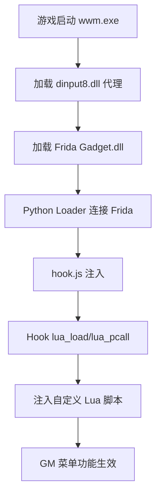

# Lua 注入流程

从游戏启动到 Lua 脚本注入执行的完整技术链路

## Sources

- 7/Where Winds Meet/README.md
- 7/Where Winds Meet  Lua Script/README.md

```mermaid
graph TD
    A[游戏启动 wwm.exe] --> B[加载 dinput8.dll 代理]
    B --> C[加载 Frida Gadget.dll]
    C --> D[Python Loader 连接 Frida]
    D --> E[hook.js 注入]
    E --> F[Hook lua_load/lua_pcall]
    F --> G[注入自定义 Lua 脚本]
    G --> H[GM 菜单功能生效]
```
